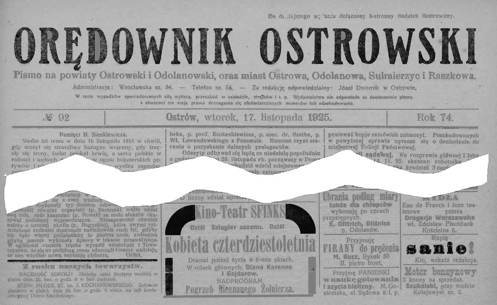

## Franciszek Siudek
Do uzupełnienia

## Marianna Siudek, z domu Żurek
Do uzupełnienia

------
## Babcia M. Gucz
* Dzieci:
  * Kazimiera Gucz

------
## Józef Zawieja
* 20.?2.1893 - 16.09.1945
* Spoczywa na cmentarzu w Ostrowie Wielkopolskim (w kwaterze z córką Mirosławą)
* Małżonek: Kazimiera Gucz
* Rodzeństwo: ???
* Dzieci:
  * Henryka Zawieja
  * Halina Zawieja
  * Mirosława Zawieja
  * Jan Zawieja
  * Krystyna Zawieja

------
## Kazimiera Zawieja, z domu Gucz
* Rodzice: M. Gucz
* 24.02.1896 - 29.10.1956
* Spoczywa na cmentarzu w Ostrowie Wielkopolskim
* Małżonek: Józef Zawieja
* Rodzeństwo: ???
* Dzieci:
  * Henryka Zawieja
  * Mirosława Zawieja
  * Halina Zawieja
  * Jan Zawieja
  * Krystyna Zawieja

---
## Edward Junger
* Syn Józefa Jungera i Anny Junger (z domu Bowszek)
* 11.02.1919 - 06.08.1992
* Spoczywa w Trzciance
* Rodzeństwo:
 * Rudolf Junger
 * Joanna Junger

------
## Henryka Trzcińska, z domu Zawieja
* Rodzice: Józef i Kazimiera Zawieja
* Data urodzenia / śmierci - do uzupełnienia
* Małżonek: ???
* Rodzeństwo:
  * Halina Zawieja
  * Mirosława Zawieja
  * Jan Zawieja
  * Krystyna Zawieja

------
## Halina Junger, z domu Zawieja
* Rodzice: Józef i Kazimiera Zawieja
* 23.01.1922 - 05.05.2006
* Spoczywa w Trzciance
* Rodzeństwo:
 * Mirosława Zawieja
 * Jan Zawieja
 * Krystyna Zawieja

------
## Mirosława Cegła, z domu Zawieja
* Rodzice: Józef i Kazimiera Zawieja
* 04.06.1923 - 14.09.2004
* Spoczywa na cmentarzu w Ostrowie Wielkopolskim (w kwaterze z ojcem Józefem)
  * Henryka Zawieja
  * Halina Zawieja
  * jan Zawieja
  * Krystyna Zawieja

------
## Jan Zawieja
* Rodzice: Józef i Kazimiera Zawieja
* 07.08.1928 - 02.01.2009
* Spoczywa na cmentarzu w Ostrowie Wielkopolskim
* Rodzeństwo: 
  * Henryka Zawieja
  * Halina Zawieja
  * Mirosława Zawieja
  * Krystyna Zawieja
* Dzieci: ???

## Józef Siudek
* Rodzice: Franciszek i Marianna Siudek

## Genowefa Siudek, z domu Fila
Do uzupełnienia

## Józef Junger
Do uzupełnienia

## Anna Junger, z domu Bowszek
Do uzupełnienia

# Wydarzenia
Do uzupełnienia

======
# Miejsca

## Kołomyja
Z kołomyji pochodzi Edward Junger. Po wojnie, posiadając dom w Trzciance przy ul. Konarskiego, Edward wrócił do Kołomyji i zabrał z tamtąd swoją mamę Annę. Grób jego ojca Józefa w Kołomyji został zniszczony.

## Ostrów Wielkopolski
W Ostrowie Wielkopolskim, pod adresem Rynek 30 pracowała (a być może i mieszkała) Babcia M. Gucz z rodziną.

Na zdjęciu: Ostrów Wielkopolski, Rynek 30. W oknach od lewej Kazimiera Zawieja i Babcia M. Gucz

Na zdjęciu: Gazeta lokalna, z reklamą usług M. Gucz

## Piotrków Trybunalski
  * Do uzupełnienia

## Trzcianka
  * Do uzupełnienia

# Postacie
* Do uzupełnienia - ważne postacie związane z rodzinami, chociaż z nimi nie spokrewnione