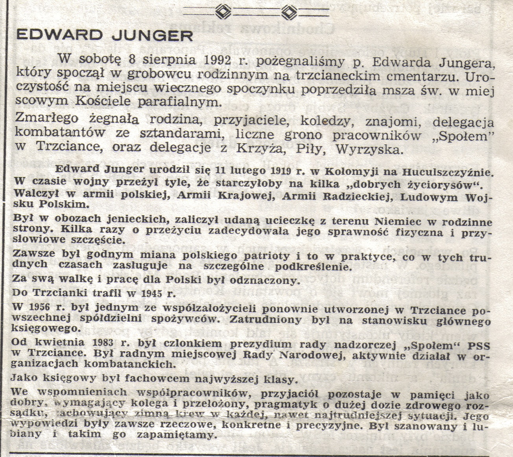
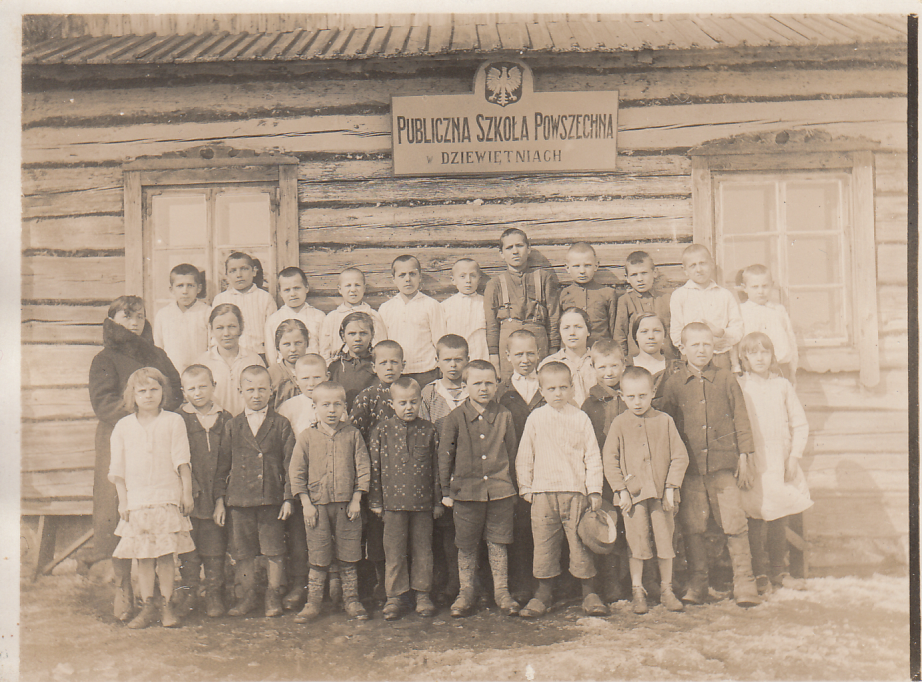

## Franciszek Siudek
* ? - 06.

## Marianna Siudek, z domu Żurek
Do uzupełnienia

------
## Babcia M. Gucz
* Dzieci:
  * Kazimiera Gucz

------
## Józef Junger
* Małżonek: Anna Bowszek
* Dzieci
  * Rudolf Junger
  * Stefania Junger
  * Edward Junger
  * Joanna Junger

------
## Anna Junger, z domu Bowszek
* 17.10.1882 - 03.03.1965
* Spoczywa na starym cmentarzu w Trzciance
* Małżonek: Józef Junger
* Rodzeństwo: nieznane
* Dzieci
  * Rudolf Junger
  * Stefania Junger
  * Joanna Junger
  * Edward Junger

------
## Józef Zawieja
* 26.02.1893 - 16.09.1945
* Spoczywa na cmentarzu w Ostrowie Wielkopolskim (w kwaterze z córką Mirosławą)
* Małżonek: Kazimiera Gucz
* Rodzeństwo: ???
* Dzieci:
  * Halina Zawieja
  * Mirosława Zawieja
  * Henryka Zawieja
  * Jan Zawieja
  * Krystyna Zawieja

------
## Kazimiera Zawieja, z domu Gucz
* Rodzice: M. Gucz
* 24.02.1896 - 29.10.1956
* Spoczywa na cmentarzu w Ostrowie Wielkopolskim
* Małżonek: Józef Zawieja
* Rodzeństwo: ???
* Dzieci:
  * Halina Zawieja
  * Mirosława Zawieja
  * Henryka Zawieja
  * Jan Zawieja
  * Krystyna Zawieja

---
## Edward Junger
* Rodzice: Józef i Anna Junger (z domu Bowszek)
* 11.02.1919 - 06.08.1992
* Spoczywa w Trzciance
* Rodzeństwo:
  * Rudolf Junger
  * Joanna Junger

Poniżej artykuł w gazecie lokalnej opublikowany w związku z pogrzebem Edwarda

------
## Halina Junger, z domu Zawieja
* Rodzice: Józef i Kazimiera Zawieja
* 23.01.1922 - 05.05.2006
* Spoczywa w Trzciance
* Rodzeństwo:
  * Mirosława Zawieja
  * Jan Zawieja
  * Krystyna Zawieja

> Powiadała: "Nigdy nie zrobisz interesu w 100 procentach"

------
## Mirosława Cegła (primo voto Cuske, secundo voto Cegła), z domu Zawieja
* Rodzice: Józef i Kazimiera Zawieja
* 04.06.1923 - 14.09.2004
* Spoczywa na cmentarzu w Ostrowie Wielkopolskim (w kwaterze z ojcem Józefem)
  * Halina Zawieja
  * Henryka Zawieja
  * Jan Zawieja
  * Krystyna Zawieja

------
## Henryka Trzcińska, z domu Zawieja
* Rodzice: Józef i Kazimiera Zawieja
* ur. 25.01.1925 w Ostrowie Wielkopolskim - zm. 07.07.2005
* Małżonek: Tadeusz Trzciński (ur. 05.07.1919)
* Rodzeństwo:
  * Halina Zawieja
  * Mirosława Zawieja
  * Jan Zawieja
  * Krystyna Zawieja
* Dzieci:
  * Andrzej Trzciński (ur. 16.05.1946 w Szczecinie, zm. 21.10.2011)
  * Jerzy Trzciński (ur. 14.02.1949 w Szczecinie)
  * Hanna Furman, z domu Trzcińska (ur. 27.10.1954 w Szczecinie)
  * Wojciech Trzciński (ur 26.06.1957 w Jasienicy)

------
## Jan Zawieja
* Rodzice: Józef i Kazimiera Zawieja
* 07.08.1928 - 02.01.2009
* Spoczywa na cmentarzu w Ostrowie Wielkopolskim
* Rodzeństwo: 
  * Halina Zawieja
  * Mirosława Zawieja
  * Henryka Zawieja
  * Krystyna Zawieja
* Dzieci: ???

## Józef Siudek
* Rodzice: Franciszek i Marianna Siudek

## Genowefa Siudek, z domu Fila
Do uzupełnienia

# Wydarzenia
Do uzupełnienia

======
# Miejsca

## Kołomyja
Z kołomyji pochodzi Edward Junger. Po wojnie, posiadając dom w Trzciance przy ul. Konarskiego, Edward wrócił do Kołomyji i zabrał z tamtąd swoją mamę Annę. Grób jego ojca Józefa w Kołomyji był już w tym czasie zniszczony (wg relacji Edwarda).

## Ostrów Wielkopolski
W Ostrowie Wielkopolskim, pod adresem Rynek 30 pracowała (a być może i mieszkała) Babcia M. Gucz z rodziną. Budynek istnieje do dnia dzisiejszego, obecnie jest to adres Plac 23 stycznia, numer domu 13.

Na zdjęciu: Ostrów Wielkopolski, Rynek 30. W oknach od lewej Kazimiera Zawieja i Babcia M. Gucz. Z lewej strony na okiennicy reklama: **Przyjmę bieliznę do prania i prasowania**

Na zdjęciu: Gazeta lokalna, z reklamą usług M. Gucz

*"W domu tym prężyła firany Kazimiera Zawieja z córką Mirą, a trafiali się i zamożniejsi klienci, jak np. producent wędlin. Wtedy najmłodsza Krysia zanosiła firany takiemu odbiorcy, za co często była nagradzana - i tak trafiało się Krysi wrócić z wędlinami. Można więc powiedzieć, że rodzinny interes prosperował w kilku płaszczyznach"* **Krystyna Muszalska _o swojej mamie, siostrze i sobie samej oraz o rodzinnym biznesie_**

## Piotrków Trybunalski
  * Do uzupełnienia

## Trzcianka
  * Do uzupełnienia

## Dziewiętnie
Joanna Jungerówna (Hasia) mieszkała z daleka od rodzinnej Kołomyji w Dziewiętniach powiat Wilejski, gmina Żodziszki, na terenie dzisiejszej Białorusi. Zmarła bezdzietnie.

Na zdjęciu: Hasia Junger, Dziewiętnia

# Postacie
* Do uzupełnienia - ważne postacie związane z rodzinami, chociaż z nimi nie spokrewnione

## Zdjęcia albumowe
Poniżej znajdziecie zdjęcia wraz z opisami, przygotowane z myślą o wykorzystaniu ich albo w albumach (po uprzednim wydrukowani) albo do wydrukowania, oprawieniu w ramki i ozdobieniu nimi ścian.