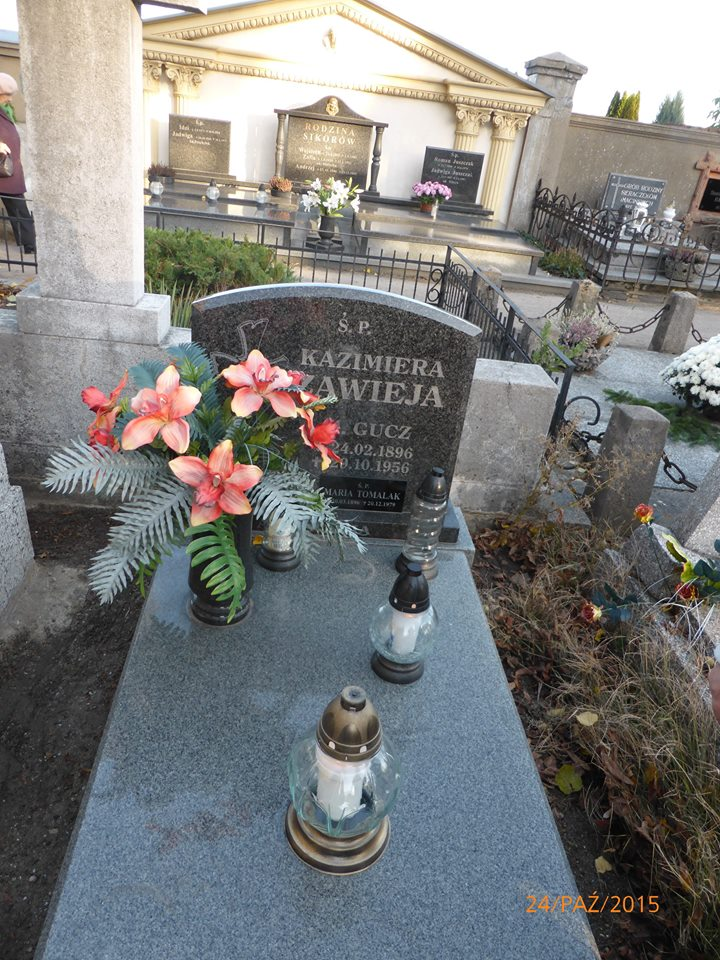

## Józef Junger

## Anna Junger, z domu Bowszek

## Edward Junger
* Syn Józefa Jungera i Anny Junger (z domu Bowszek)
* Rodzeństwo:
 * Rudolf Junger
 * Joanna Junger

## Halina Junger, z domu Zawieja
* Córka TBD i Kazimiery Zawieja, z domu Gucz
* Rodzeństwo:
 * Mirosława Zawieja
 * Jan Zawieja
 * Krystyna Zawieja

## Franciszek Siudek

## Marianna Siudek, z domu Żurek

------
## Kazimiera Zawieja, z domu Gucz
* 24.02.1896 - 29.10.1956
* Spoczywa na cmentarzu w Ostrowie Wielkopolskim

* Rodzice: ???
* Rodzeństwo: ???
* Dzieci:
  * Mirosława Zawieja
  * Halina Zawieja
  * Jan Zawieja
  * Krystyna Zawieja

## Józef Siudek
* Syn Franciszka Siudka i Marianny Siudek, z domu Żurek

## Genowefa Siudek, z domu Fila

# Wydarzenia

# Miejsca
* Kołomyja
* Ostrów Wielkopolski
* Piotrków Trybunalski
* Trzcianka

# Postacie